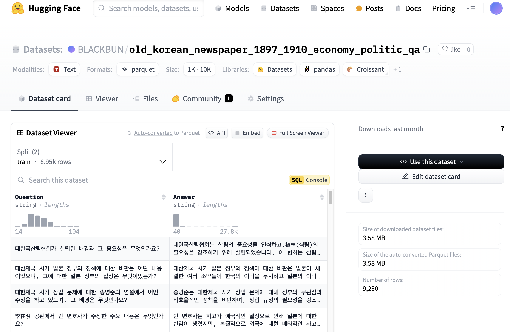
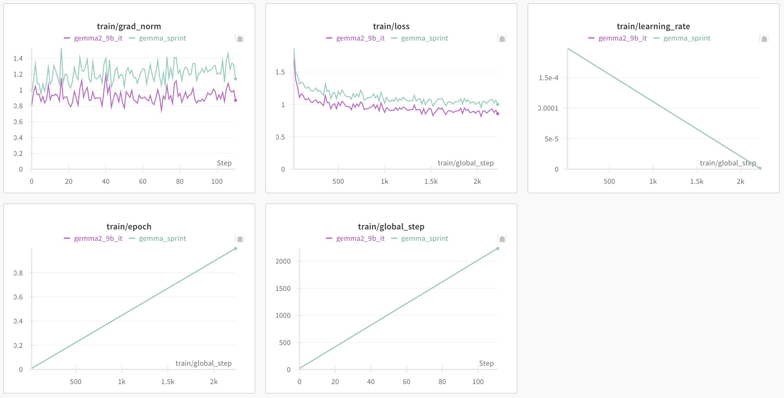
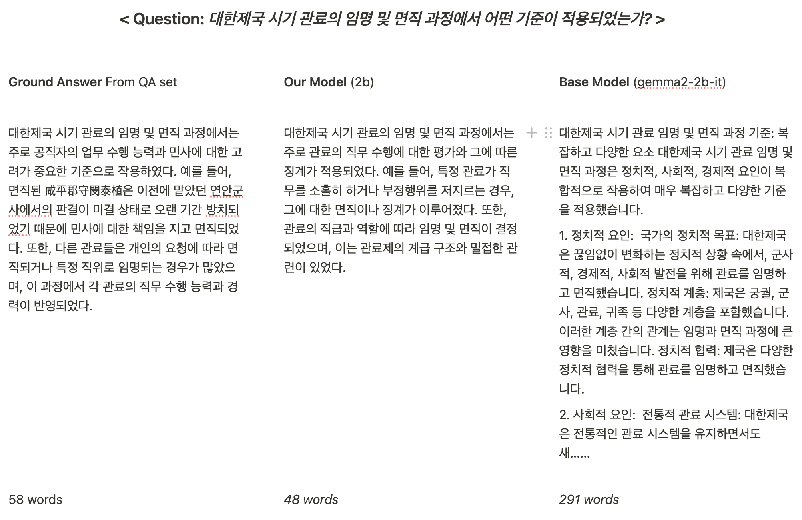
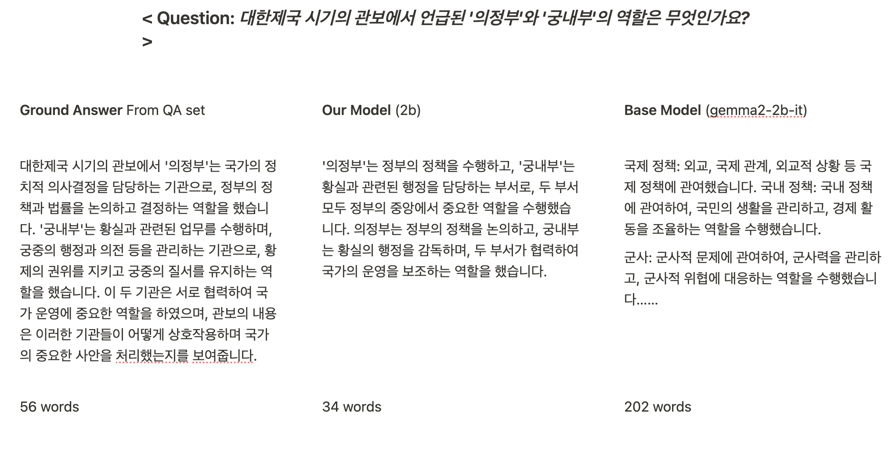
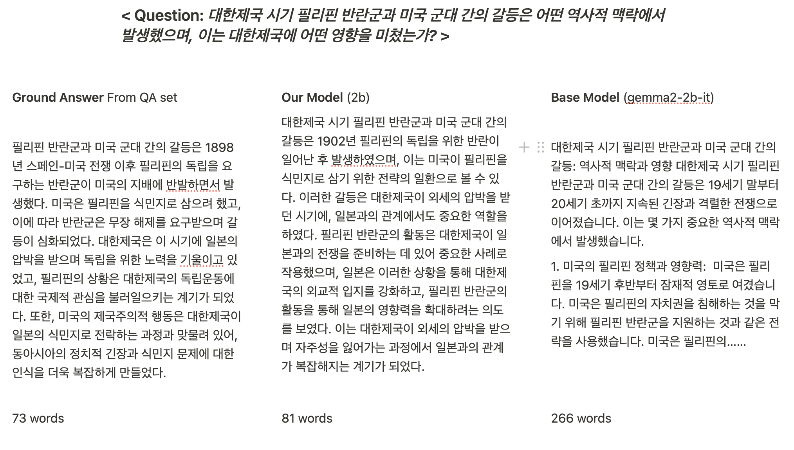

# README.md

# < AI Newspaper Instructor >

# Abstract

This project aims to finetune Gemma2 models as a Korean history instructor. We collected Korean newspaper articles from 1887-1910, which corresponds to the Korean Empire (대한제국) period, and created a Question & Answer (QA) dataset using GPT4-mini. By training Gemma models with our QA dataset, we fine-tuned models to serve as history instructors for educational purposes.

# Background

This project is part of the Google Gemma Sprint, an activity within the Google Machine Learning Bootcamp 2024, with the overall goal of fine-tuning Gemma2 models. For our specific implementation, we set the following self-imposed conditions to guide our project:

1. Utilize the Korean language, leveraging Gemma's multilingual support.
2. Work with older data to avoid copyright infringement issues.
3. Focus on a topic suitable for fine-tuning, addressing challenges that cannot be resolved through prompt engineering alone.

# Introduction

The project focuses on creating an AI instructor specializing in the history of the Korean Empire period. This topic was chosen for several reasons:

1. The National Library of Korea provides an archive of Korean newspapers ([https://www.nl.go.kr/newspaper/](https://www.nl.go.kr/newspaper/)) that includes copyright-expired articles from historical newspapers.
2. The Korean Empire period marks the beginning of newspaper circulation in Korea.
3. The Korean language used in the early 1900s differs significantly from modern Korean, making it challenging to read and therefore suitable for AI assistance.
4. The articles from this period are relatively consistent in length and contain numerous political and social pieces that provide insights into the contemporary social atmosphere.

# Data

## Preprocessing


The original dataset consisted of 441,133 articles, of which 322,921 were provided in text format. After analyzing the text length distribution, we filtered the data to focus on political and social topics, resulting in 181,143 articles. The dataset was then split into training and test sets:

- Train: 8,946 articles with more than 500 characters
- Test set: 284 articles with 491-500 characters

## QA Set Generation



To create the QA dataset for training Gemma models, we selected articles from the Korean Empire period that belong to the social/political field and contain more than 500 characters. This process yielded approximately 10,000 data points, which were used to generate the QA dataset. This dataset was then used to train the Gemma model, creating an AI history instructor suitable for educational purposes.

The dataset includes:

- RDF Dataset File (TTL format) for newspaper articles categorized by period and topic from the Korean Newspaper Archive's high newspaper digital collection service.
- QA Dataset File containing two columns: Question and Answer.

We used GPT4-mini to batch process the selected articles and synthesize the QA dataset from the gathered newspaper articles. The final dataset consists of 8,946 training samples and 284 test samples.

Dataset is available on HuggingFace: [BLACKBUN/old_korean_newspaper_1897_1910_economy_politic_qa](https://huggingface.co/datasets/BLACKBUN/old_korean_newspaper_1897_1910_economy_politic_qa)

### Data Synthesizing Prompt

**Prompt**

대한제국 시기 기사를 분석해서 역사적인 관점에서 하나의 QUESTION & ANSWER 쌍을 만들어줘. 응답은 한국어로 해줘. 그리고 Question: Answer: 를 분명하게 구분해줘

**English Translation**
"Analyze an article from the Korean Empire period and create a QUESTION & ANSWER pair from a historical perspective. Answer in Korean. Make sure to clearly separate Question: and Answer:."

### Format

**Input Format**

```json
"messages": [
    {
        "role": "system",
        "content": system_prompt
    },
    {
        "role": "user",
        "content": article
    }
],
```

**Output Format**

```json
{
	"Question": question,
	"Answer": answer
}
```

# Training



## Environment

We trained model on Kaggle: Tesla T4 x 2. 

We used the HuggingFace Transformer library for implementation.

| Model | Method | Epoch | Duration |
| --- | --- | --- | --- |
| Gemma2-2b-it | LoRA | 1 | 49m 22s |
| Gemma2-9b-it | LoRA, 4-bit Quantization | 1 | 3h 49m 35s |

## Models

Models are available on HuggingFace: 

Gemma 2b: [https://huggingface.co/jia6776/korean_history_1897_1910_gemma2_2b_lora](https://huggingface.co/jia6776/korean_history_1897_1910_gemma2_2b_lora)

Gemma 9b: [https://huggingface.co/BLACKBUN/korean_history_1897_1910_gemma2_9b_lora_q4](https://huggingface.co/BLACKBUN/korean_history_1897_1910_gemma2_9b_lora_q4)

# Evaluation

We evaluated the model's performance using randomly selected QA pairs from the test set. Three examples were provided to demonstrate the model's ability to answer historical questions accurately.

### Example 1



### Example 2



### Example 3



# Limitations

Despite the model's strengths, there are some limitations to consider:

1. The model's scope is limited to articles from the Korean Empire period (1887-1910), which may restrict its applicability to other periods of Korean history or global historical events.
2. The training data is biased towards politically and socially significant events, potentially leaving gaps in cultural, scientific, or less-documented historical areas.

# Future Improvements

To enhance the model's capabilities, future iterations could:

1. Incorporate a more diverse dataset, including additional historical periods or other types of historical documents such as journals, books, or international perspectives on Korean history.
2. Implement continuous training and updating with more recent historical findings to improve the model's depth and applicability across a broader range of educational queries.

# Conclusion

This project successfully fine-tuned Gemma models using a QA dataset created from Korean newspaper articles dating from the Korean Empire period (1887-1910). By selecting historical articles from social and political categories and generating approximately 9,000 QA pairs, we trained models capable of acting as specialized history instructors. The goal was to provide students with a reliable AI tool that could offer accurate, well-sourced answers to historical inquiries, thereby mitigating issues associated with unreliable or incomplete information commonly found on the internet.
Our methodology involved extracting pertinent information from newspaper articles, initially formatted in RDF dataset files, and using a synthesizing approach with OpenAI's GPT4o-mini to generate a robust QA dataset. By fine-tuning the Gemma models (specifically, Gemma2-2b-it and Gemma2-9b-it) with techniques such as LoRA and Quantization, we aimed to create an educational tool tailored to students, enhancing the learning experience by providing accurate, reliable, and clear responses to historical questions.
This work contributes to improving historical education by leveraging AI to overcome challenges related to unreliable online information, thus fostering a better understanding of Korean history during a crucial period of its past.

# References