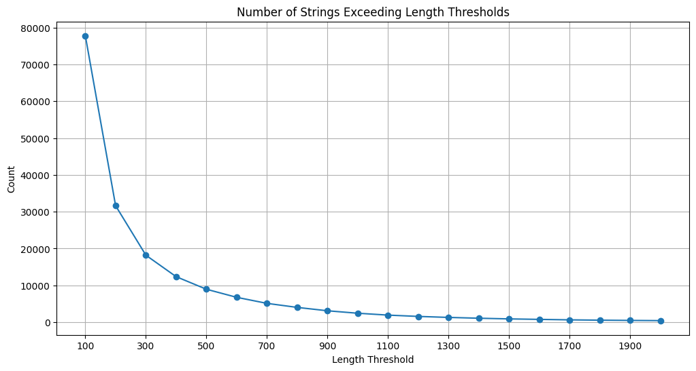

# AI Newspaper Instructor


## Table of Contents
- [Abstract](#abstract)
- [Background](#background)
- [Introduction](#introduction)
- [Data](#data)
  - [Preprocessing](#preprocessing)
  - [QA Set Generation](#qa-set-generation)
- [Training](#training)
- [Evaluation](#evaluation)
- [Limitations](#limitations)
- [Future Improvements](#future-improvements)
- [Potential Applications](#potential-applications)
- [Conclusion](#conclusion)
- [References](#references)


# Abstract

This project focuses on fine-tuning Gemma2 models to create a specialized Korean history instructor. We collected and processed Korean newspaper articles from the Korean Empire period (1887-1910) to create a comprehensive Question & Answer (QA) dataset. By training Gemma models with this dataset, we developed AI-powered history instructors capable of providing accurate and contextual information about this significant era in Korean history.


# Background

As part of the Google Gemma Sprint within the Google Machine Learning Bootcamp 2024, our project aims to fine-tune Gemma2 models. We established the following self-imposed guidelines:

1. Leverage Gemma's multilingual support by focusing on the Korean language.
2. Utilize historical data to avoid copyright issues and explore unique applications.
3. Address complex challenges that go beyond simple prompt engineering.


# Introduction

Our project creates an AI instructor specializing in the Korean Empire period's history. We chose this focus for several compelling reasons:

1. Access to copyright-free historical newspaper articles from the National Library of Korea's archive (https://www.nl.go.kr/newspaper/).
2. The Korean Empire period marks the dawn of newspaper circulation in Korea, offering unique insights into the era.
3. The archaic Korean language used in these articles presents a challenge well-suited for AI assistance.
4. The articles provide consistent length and rich political and social content, ideal for historical analysis.


# Data
## Preprocessing



Our initial dataset comprised 441,133 articles, with 322,921 in text format. After filtering for political and social topics, we retained 181,143 articles. The final dataset was split as follows:

- Training set: 8,946 articles (>500 characters each)
- Test set: 284 articles (491-500 characters each)


## QA Set Generation


We created our QA dataset by selecting articles from the social/political domain with over 500 characters. This process yielded approximately 10,000 data points, which were used to generate QA pairs. The dataset includes:

- RDF Dataset File (TTL format) for categorized newspaper articles
- QA Dataset File with Question and Answer columns

We employed GPT4-mini to batch process and synthesize QA pairs from the articles. The final dataset consists of 8,946 training samples and 284 test samples.

The dataset is available on HuggingFace: [BLACKBUN/old_korean_newspaper_1897_1910_economy_politic_qa](https://huggingface.co/datasets/BLACKBUN/old_korean_newspaper_1897_1910_economy_politic_qa)


### Data Synthesizing Prompt

**Prompt (Korean)**
대한제국 시기 기사를 분석해서 역사적인 관점에서 하나의 QUESTION & ANSWER 쌍을 만들어줘. 응답은 한국어로 해줘. 그리고 Question: Answer: 를 분명하게 구분해줘

**English Translation**
"Analyze an article from the Korean Empire period and create a QUESTION & ANSWER pair from a historical perspective. Answer in Korean. Clearly separate the Question: and Answer:."


### Format

**Input Format**

```json
"messages": [
    {
        "role": "system",
        "content": system_prompt
    },
    {
        "role": "user",
        "content": article
    }
],
```

**Output Format**

```json
{
	"Question": question,
	"Answer": answer
}
```


# Training


## Environment

We conducted training on Kaggle using Tesla T4 x 2 GPUs and implemented our models using the HuggingFace Transformers library.

| Model | Method | Epoch | Duration |
| --- | --- | --- | --- |
| Gemma2-2b-it | LoRA | 1 | 49m 22s |
| Gemma2-9b-it | LoRA, 4-bit Quantization | 1 | 3h 49m 35s |

## Models

Our fine-tuned models are available on HuggingFace:

- Gemma 2b: [jia6776/korean_history_1897_1910_gemma2_2b_lora](https://huggingface.co/jia6776/korean_history_1897_1910_gemma2_2b_lora)
- Gemma 9b: [BLACKBUN/korean_history_1897_1910_gemma2_9b_lora_q4](https://huggingface.co/BLACKBUN/korean_history_1897_1910_gemma2_9b_lora_q4)

# Evaluation

We evaluated our models using randomly selected QA pairs from the test set. Here are three examples demonstrating the model's ability to answer historical questions accurately:

### Example 1


### Example 2


### Example 3


# Limitations

While our model shows promise, it has some limitations:

1. The scope is restricted to the Korean Empire period (1887-1910), limiting its applicability to other historical periods or global events.
2. The training data focuses on political and social events, potentially under-representing cultural, scientific, or less-documented aspects of the era.

# Future Improvements

To enhance our model's capabilities, we propose:

1. Expanding the dataset to include diverse historical periods and document types (e.g., journals, books, international perspectives on Korean history).
2. Implementing continuous training with recent historical findings to improve the model's depth and educational value.

# Potential Applications

Our AI Newspaper Instructor project opens up several avenues for historical research and education:

- Sentiment Analysis: Analyze public opinion trends during the Korean Empire period by extracting sentiments from historical news articles.
- Historical Language Modeling: Develop specialized language models to capture and study linguistic patterns specific to late 19th and early 20th century Korean.
- Educational Content Generation: Automatically create summaries of key historical events and generate study materials, such as quizzes, based on the newspaper archive.
- Social Network Analysis: Map relationships between historical figures by analyzing their co-occurrences in news articles, revealing power structures and social dynamics of the era.

# Conclusion

This project successfully fine-tuned Gemma models using a QA dataset derived from Korean newspaper articles of the Korean Empire period (1887-1910). By generating approximately 9,000 QA pairs from historical articles, we created specialized AI history instructors capable of providing accurate, well-sourced answers to historical inquiries. This tool aims to enhance historical education by offering reliable information and mitigating issues associated with unreliable online sources.

Our methodology involved extracting information from RDF-formatted newspaper articles and using GPT4o-mini to generate a robust QA dataset. By fine-tuning Gemma2-2b-it and Gemma2-9b-it models using LoRA and Quantization techniques, we developed an educational tool tailored to students, providing accurate and clear responses to historical questions.

This work contributes significantly to improving historical education by leveraging AI to overcome challenges related to unreliable online information, fostering a better understanding of Korean history during a crucial period of its past.


To explore our project results, you can access:

- Our QA Dataset: [BLACKBUN/old_korean_newspaper_1897_1910_economy_politic_qa](https://huggingface.co/datasets/BLACKBUN/old_korean_newspaper_1897_1910_economy_politic_qa)
- Fine-tuned Gemma 2b Model: [jia6776/korean_history_1897_1910_gemma2_2b_lora](https://huggingface.co/jia6776/korean_history_1897_1910_gemma2_2b_lora)
- Fine-tuned Gemma 9b Model: [BLACKBUN/korean_history_1897_1910_gemma2_9b_lora_q4](https://huggingface.co/BLACKBUN/korean_history_1897_1910_gemma2_9b_lora_q4)

# References

## Models
- google/gemma-2-2b-it: [https://huggingface.co/google/gemma-2-2b-it](https://huggingface.co/google/gemma-2-2b-it)
- google/gemma-2-9b-it: [https://huggingface.co/google/gemma-2-9b-it](https://huggingface.co/google/gemma-2-9b-it)

## Data
- 대한민국 신문 아카이브 - 고신문 디지털 컬렉션 (대한제국): [Korea Newspaper Archive - Old Newspaper Digital Collection (Korean Empire)](https://www.nl.go.kr/newspaper/oldnews_info.do?collection_type=age1)

